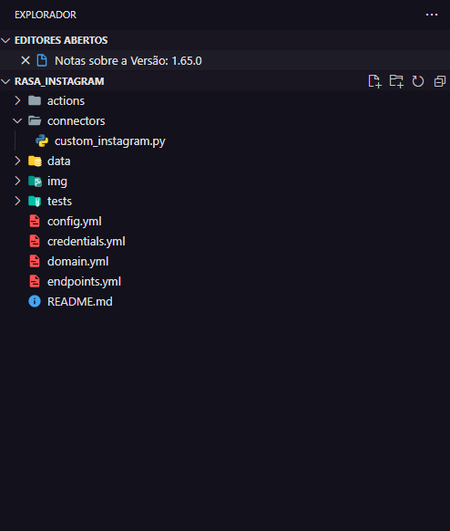
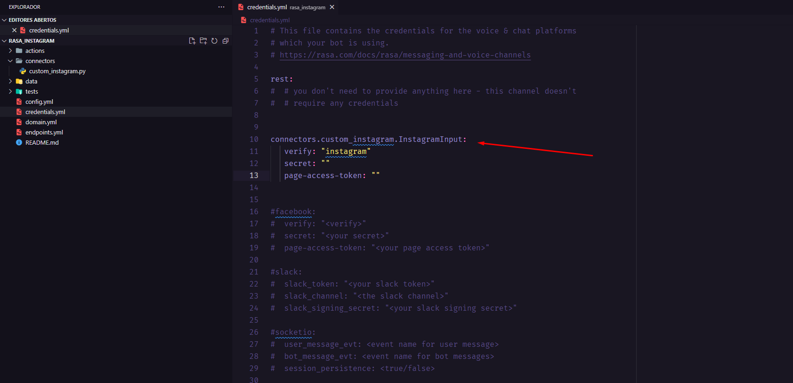
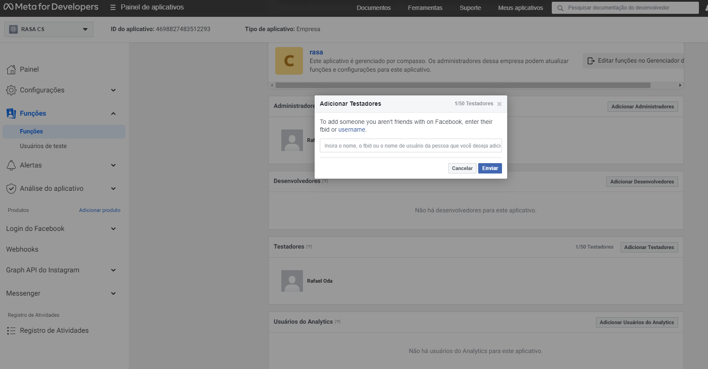
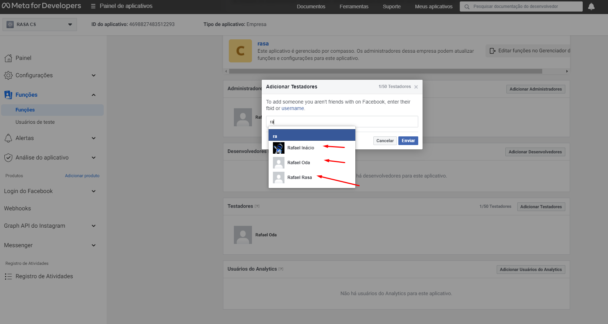
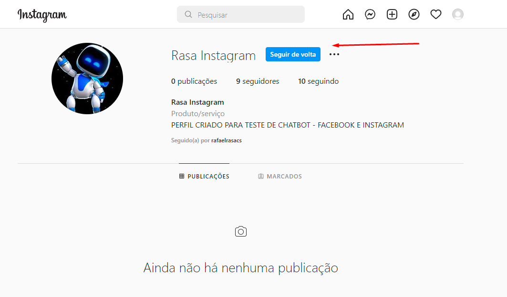
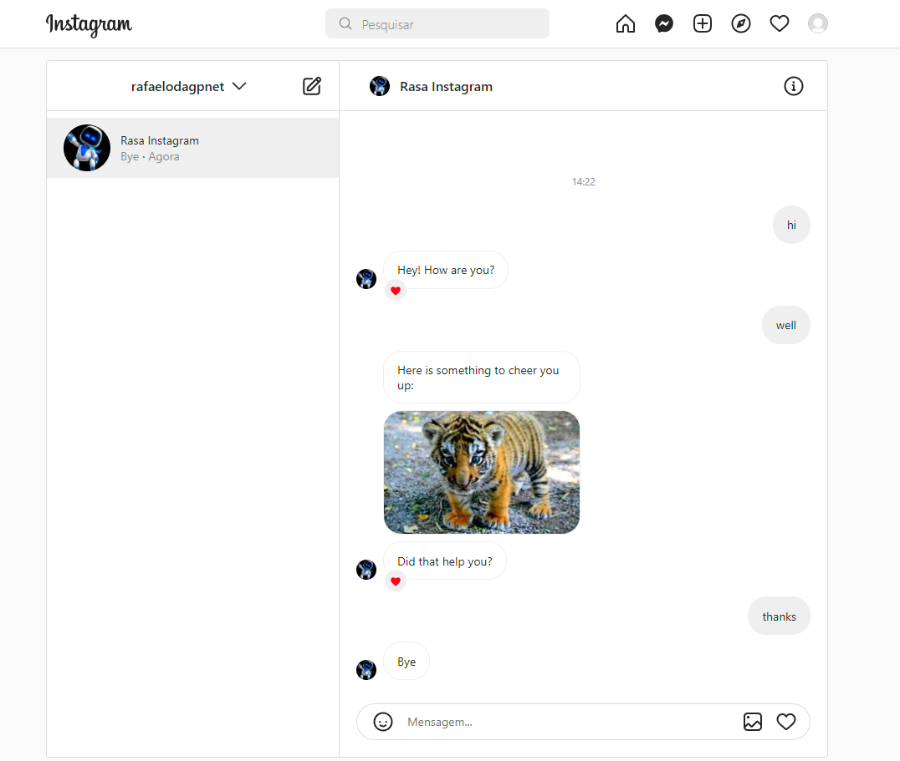

# **Rasa chatbot on Instagram**

## **Overview**

This document is intended to help you to deploy your rasa Chatbot (Custom Connectors), for Instagram.

## **Instagram Setup**

First, you need to set up a [Facebook Page](https://www.facebook.com/business/pages) and an [app](https://developers.facebook.com/docs/messenger-platform/) to get the credentials to connect to Instagram Messenger. Once you get them, you can add them to your credentials.yml.

## Chatbot Rasa

- Create the directory `connectors` with an custom_instagram.py file inside, so add the code available below:
    
    File:
    [custom_instagram.py](https://github.com/rafaelinacioo/rasa_instagram/blob/main/connectors/custom_instagram.py)
    

- Now, in the project root credentials.yml, create your connector `connectors.custom_instagram.InstagramInput` that is configured to return the name “instragram”:

## 

### Getting Credentials

**How to get the Facebook credentials:** You need to set up a Facebook app and a page.

1. To create the app head over to **[Facebook for Developers](https://developers.facebook.com/)** and click on **My Apps** → **Add New App**.
2. Go onto the dashboard for the app and under **Products**, find the **Messenger** section and click **Set Up**. Scroll down to **Token Generation** and click on the link to create a new page for your app.
3. Create your page and select it in the dropdown menu for the **Token Generation**. The shown **Page Access Token** is the `page-access-token` needed later on.
4. Locate the **App Secret** in the app dashboard under **Settings** → **Basic**. This will be your `secret`.
5. Use the collected `secret` and `page-access-token` in your `credentials.yml`, and add a field called `verify` containing a string of your choice. Start `rasa run` with the `-credentials credentials.yml` option.
6. Set up a **Webhook** and select at least the **messaging** and **messaging_postback** subscriptions. Insert your callback URL, which will look like `https://<host>:<port>/webhooks/facebook/webhook`, replacing the host and port with the appropriate values from your running Rasa X or Rasa Open Source server.
    
    Insert the **Verify Token** which has to match the `verify` entry in your `credentials.yml`.
    

## **Running on Instagram**

Add Instagram credentials to your credentials.yml:
connectors.custom_instagram.InstagramInput:

    verify: "instagram"
    secret: ""    
    page-access-token : ""

## **Configure Instagram**

Adding User for Chatbot Test.
- Click on the **Functions** menu then click on “functions” and in the center of the screen click on “Add Testers”.
Note: To show the profile in the field, when adding a tester, both must be friends on Facebook.

- Now just access Instagram, and follow the page.

- Then let's talk to the profile.

- We have reached the end of the Instagram Chatbot integration.

## **Reference**

- [Rasa Facebook Messenger](https://rasa.com/docs/rasa/connectors/facebook-messenger/)

- [Facebook Developers](https://developers.facebook.com/)

- [Rasa Connecting to A Channel](https://rasa.com/docs/rasa/messaging-and-voice-channels#testing-channels-on-your-local-machine)

- [Instagram API](https://developers.facebook.com/products/messenger/messenger-api-instagram/)

- [Facebook business](https://www.facebook.com/business/pages)

- [Instagram Webhook](https://developers.facebook.com/docs/messenger-platform/webhook)